# Readable

Readable is a toy application that demonstrates the use of React and Redux to 
create a simple Reddit clone.

## Installation

1. Clone this repository by running `git clone https://github.com/MisterTJB/readable-react.git` from a terminal
2. Navigate to the `api-server` subdirectory
3. Run `yarn install`. When the installation completes, run `yarn start`
4. Open a second terminal and navigate to the `readable` subdirectory (i.e. `path-to-download/readable-react/readable`)
5. Run `yarn install`. When the installation completes, run `yarn start`

This should launch a browser window with the application running inside of 
it. If not, open a browser and navigate to `localhost:3000`.

## Features

### Home Page

The home page lists posts with their title, author, number of comments, current score, 
and a voting mechanism to upvote or downvote the post. There are buttons for editing or deleting that post.

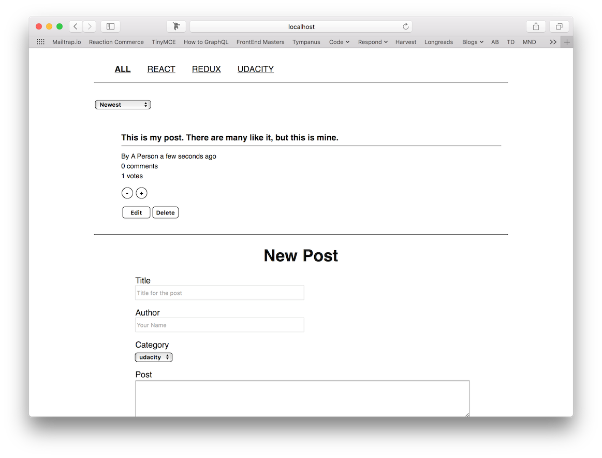

#### Voting

Users can increment or decrement the number of votes for a post by clicking the plus and minus buttons. These actions immediately update the UI, and these changes are persisted in the database.

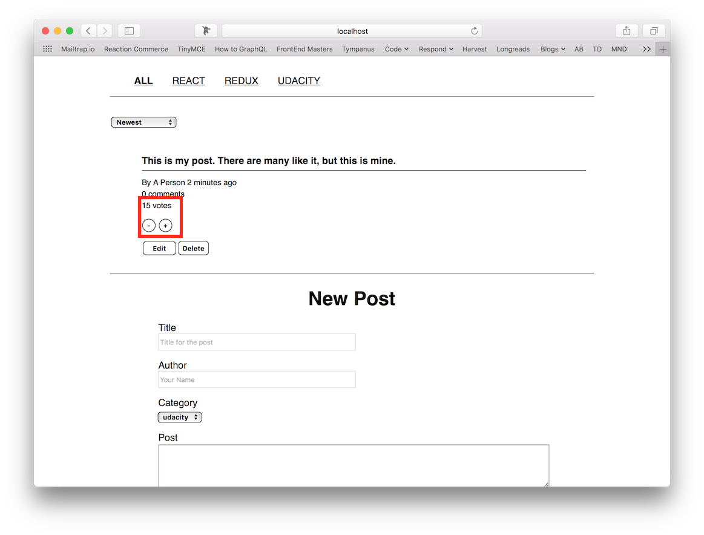

#### Sorting

Users can sort posts by popularity or age from the menu at the top-left. Posts are ordered from newest to oldest 
by default.

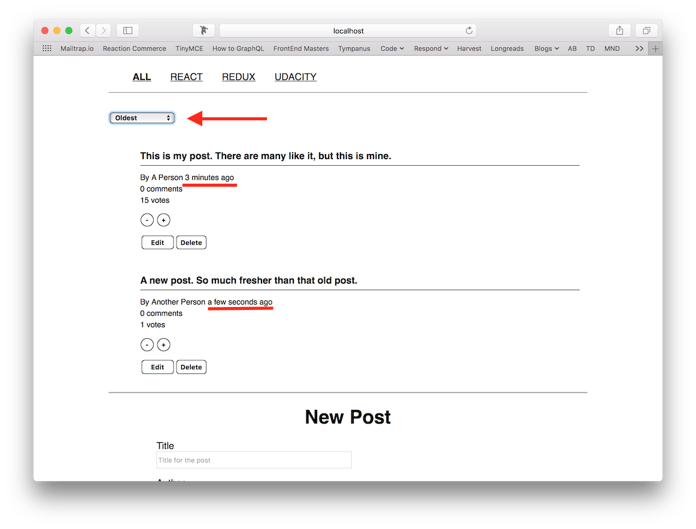

### Category Page

The category page is almost identical to the main page in that it comprises all of the same voting, sorting, etc. features as the main page. However, it only lists the posts that belong the specified category.

Users navigate to specific category views from the navigation bar at the top of the UI.

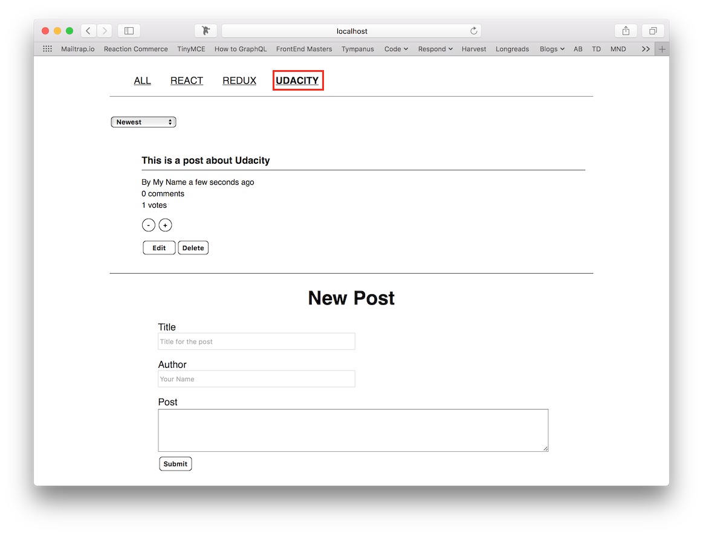

### Post Detail

A more-detailed representation of a post can be accessed by clicking the post title from the Home or Category 
views. A post is displayed with title, body, author, number of comments, current score and voting mechanism. The post also has buttons for editing or deleting the post.

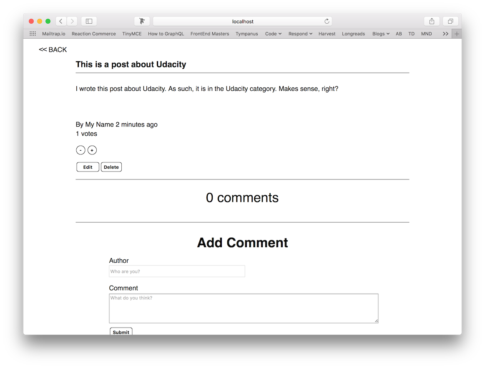

The Post Detail view differs from the Home and Category views in that it also includes a comment function. Comments are displayed with author, current score, and a voting mechanism to upvote or downvote the comment. Comments also have buttons for editing or deleting that comment.

Note that comments are sorted by score. This falls outside of the rubric, and, on reflection, is kind of confusing. Oops.

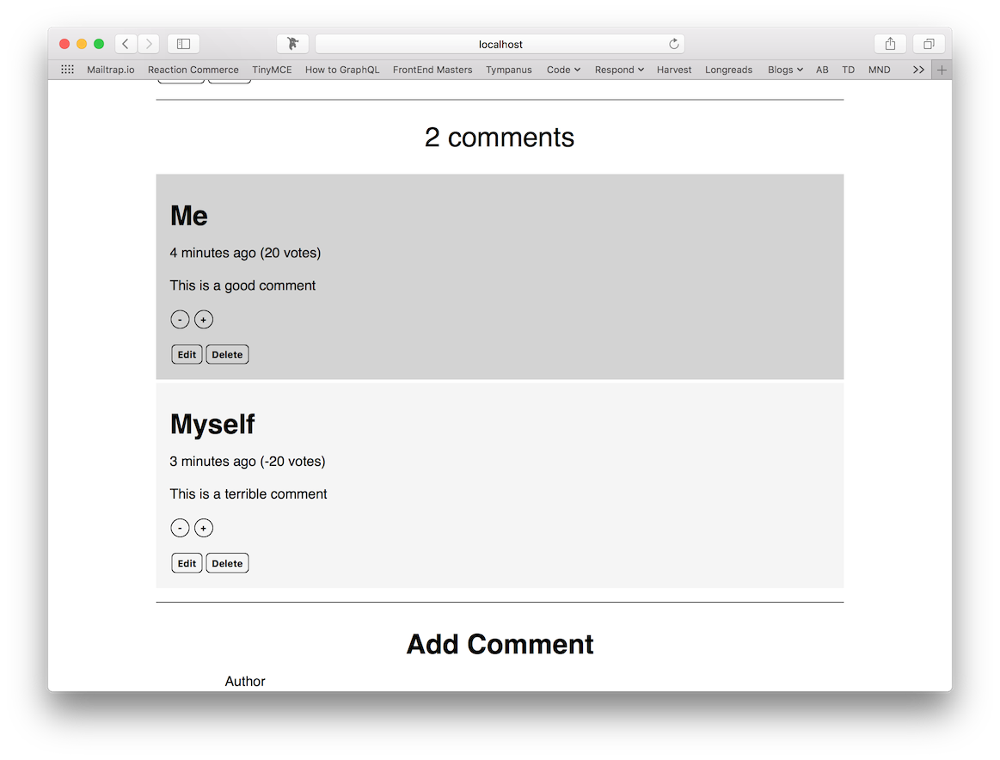

### Creating, Editing, and Deleting Posts

#### Creating

Posts are created from the Home and Category views via the form at the bottom of the page. Adding a post immediately 
adds the post to the Home or Category view with its relevant metadata (score, timestamp, author, etc.).

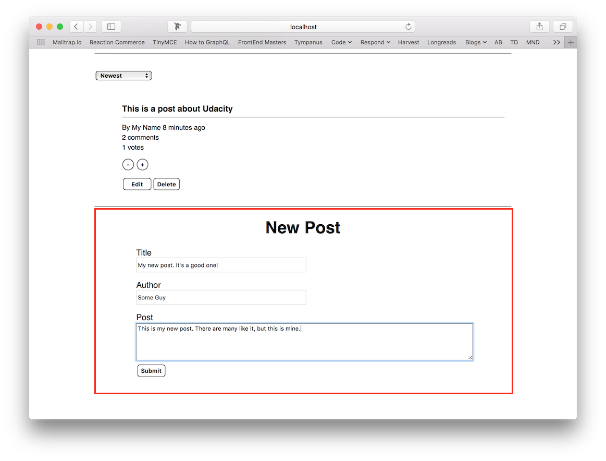

#### Editing

Posts can be edited by clicking the Edit button, which will launch an inline (if the post is edited from the Home or 
Category view) or standalone (if the post is edited from the Post Detail view) editor. In either case, the changes to the post can be saved by choosing submit, or cancelled, and the post will be immediately updated.

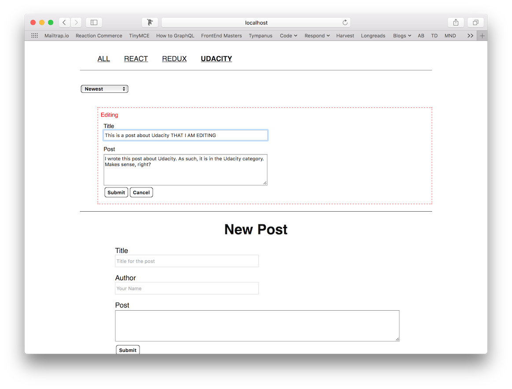

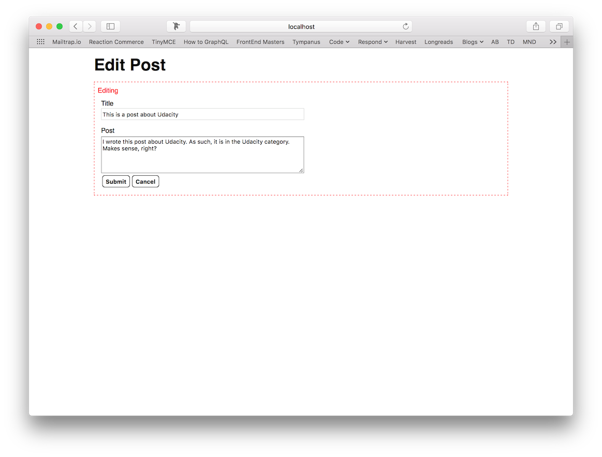

#### Deleting

Posts can be deleted from Home, Category and Post Detail views by clicking the Delete button. When a post is deleted, it is removed from the database and is no longer accessible at its URL — the user will be redirected back to the main page when they delete a post.

Additionally, if a user attempts to access a post that has been deleted, they will be presented with an error page.

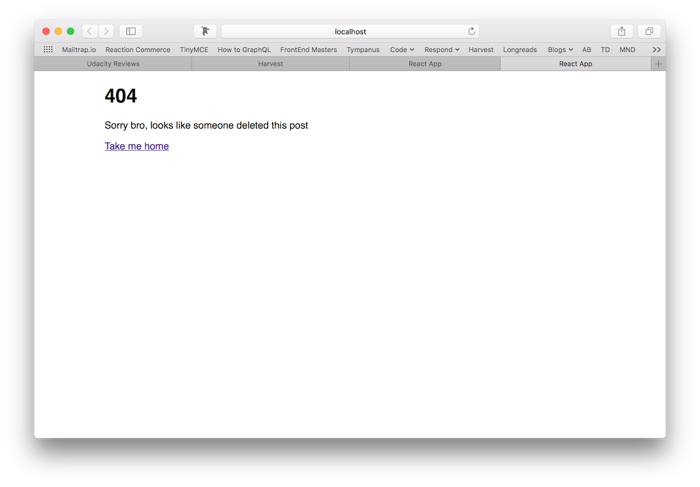

### Creating, Editing, and Deleting Comments

#### Creating

Comments are created via the form at the bottom of the Post Detail view. Adding a comment immediately 
adds the comment to the list of comments with its relevant metadata (score, timestamp, author, etc.).

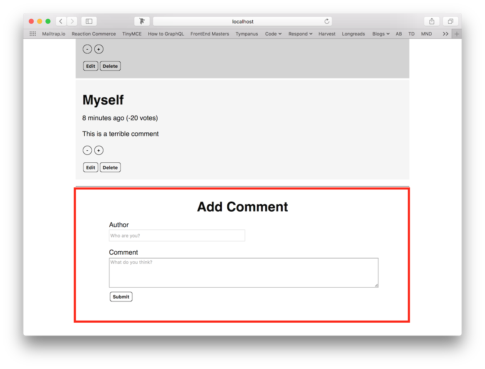

#### Editing

Comments can be edited by clicking the Edit button, which will launch an inline editor. The changes to the comment can be saved by choosing submit, or cancelled, and the comment will be immediately updated.

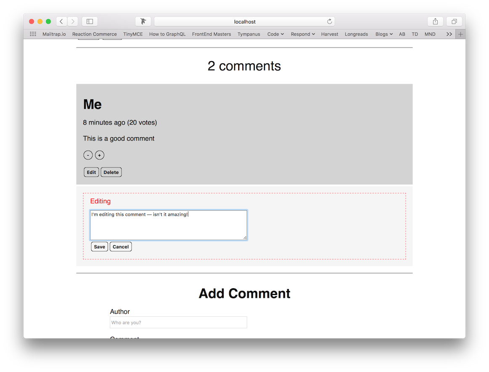

#### Deleting

Comments can be deleted from the Post Detail view by clicking the Delete button. The comment will be immediately removed from the list of comments.

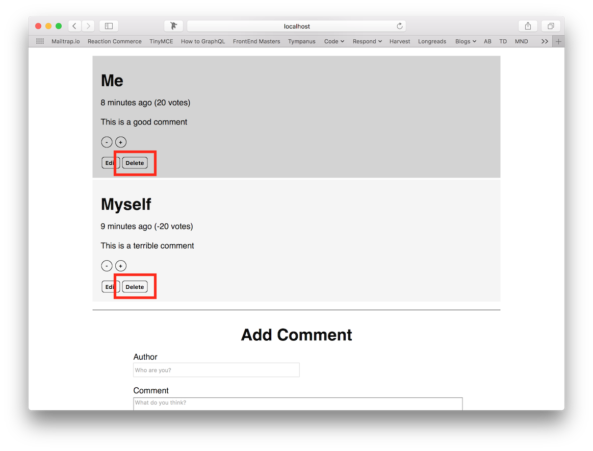

### Navigation

Navigation is provided at the top of the UI, and via embedded links, so that users do not need to use the 
address bar to move about the application.